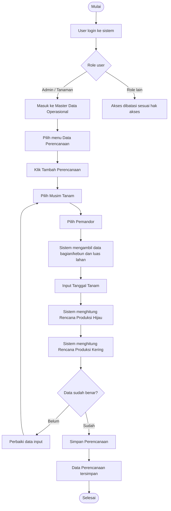
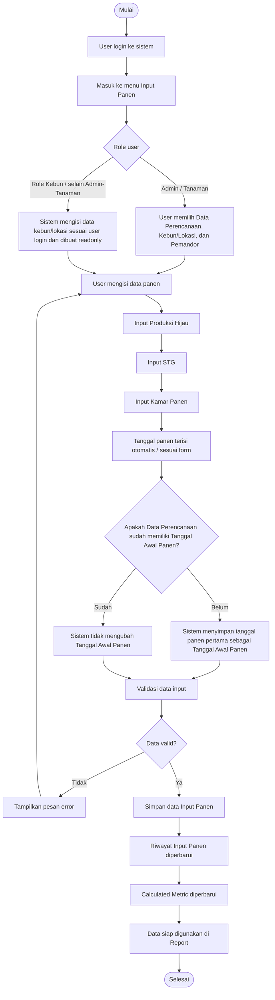
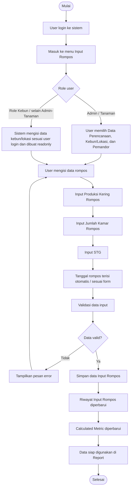
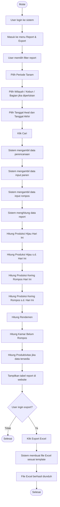
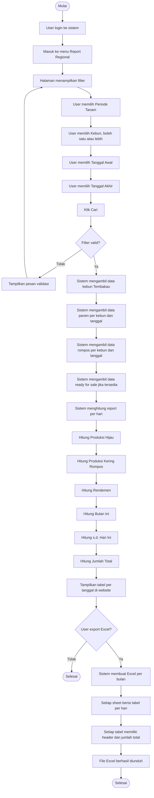

# Flowchart Sistem Tembakau

Dokumen ini menjelaskan alur penggunaan sistem tembakau, mulai dari pembuatan perencanaan, input panen, input rompos, hingga proses report.

---

## 1. Flowchart Pembuatan Perencanaan Tembakau

Perencanaan digunakan sebagai dasar data produksi tembakau. Data ini berisi musim tanam, pemandor, bagian/kebun, luas lahan, rencana produksi hijau, rencana produksi kering, dan tanggal tanam.



### Penjelasan Alur

1. User login ke sistem.
2. User dengan role **Admin** atau **Tanaman** masuk ke menu **Master Data Operasional**.
3. User membuka menu **Data Perencanaan**.
4. User membuat data perencanaan baru.
5. User memilih **Musim Tanam** dan **Pemandor**.
6. Sistem mengambil informasi bagian/kebun dan luas lahan dari master data.
7. User mengisi tanggal tanam.
8. Sistem menghitung rencana produksi:
   - Rencana Produksi Hijau = Luas Ha x 17.500
   - Rencana Produksi Kering = Luas Ha x 1.750
9. Jika data sudah benar, user menyimpan data perencanaan.
10. Data perencanaan akan digunakan untuk input panen, input rompos, dan report.

---

## 2. Flowchart Input Panen Tembakau

Input Panen digunakan untuk mencatat produksi hijau dari kegiatan panen tembakau.



### Penjelasan Alur

1. User masuk ke menu **Input Panen**.
2. Jika user adalah **Admin** atau **Tanaman**, user bisa memilih data perencanaan, kebun/lokasi, dan pemandor.
3. Jika user adalah role kebun atau role selain Admin/Tanaman, data kebun/lokasi mengikuti data user login dan tidak bisa dipilih bebas.
4. User menginput **Produksi Hijau**, **STG**, dan **Kamar Panen**.
5. Sistem mengecek apakah data perencanaan sudah memiliki **Tanggal Awal Panen**.
6. Jika belum ada, tanggal panen pertama disimpan sebagai tanggal awal panen.
7. Jika sudah ada, tanggal awal panen tidak diubah.
8. Sistem menyimpan data input panen.
9. Data masuk ke riwayat input dan digunakan untuk report.

---

## 3. Flowchart Input Rompos Tembakau

Input Rompos digunakan untuk mencatat produksi kering atau hasil rompos dari tembakau.



### Penjelasan Alur

1. User masuk ke menu **Input Rompos**.
2. Jika user adalah **Admin** atau **Tanaman**, user dapat memilih data perencanaan, kebun/lokasi, dan pemandor.
3. Jika user adalah role kebun atau role selain Admin/Tanaman, data kebun/lokasi mengikuti user login dan tidak bisa dipilih bebas.
4. User menginput **Produksi Kering Rompos**, **Jumlah Kamar Rompos**, dan **STG**.
5. Sistem melakukan validasi data.
6. Jika data valid, sistem menyimpan input rompos.
7. Data masuk ke riwayat input dan digunakan untuk report.

---

## 4. Flowchart Report Tembakau

Report digunakan untuk menampilkan rekap data panen dan rompos berdasarkan filter yang dipilih.



### Penjelasan Alur

1. User membuka menu **Report & Export**.
2. User memilih filter seperti **Periode Tanam**, **Wilayah**, **Kebun**, **Bagian**, **Tanggal Awal**, dan **Tanggal Akhir**.
3. Sistem mengambil data dari **Master Perencanaan**, **Input Panen**, dan **Input Rompos**.
4. Sistem menghitung produksi hijau, produksi kering rompos, rendemen, kamar belum rompos, dan produktivitas.
5. Report ditampilkan dalam bentuk tabel.
6. Jika user melakukan export, sistem membuat file Excel sesuai template.

---

## 5. Flowchart Report Regional Tembakau

Report Regional digunakan untuk menampilkan rekap produksi tembakau per kebun dan per hari.



### Penjelasan Alur

1. User masuk ke menu **Report Regional**.
2. Saat halaman pertama dibuka, report tidak langsung tampil.
3. User harus memilih **Periode Tanam**, **Kebun**, **Tanggal Awal**, dan **Tanggal Akhir**.
4. Sistem menampilkan report berdasarkan filter.
5. Data dihitung per kebun dan per tanggal.
6. Jika rentang tanggal melewati beberapa bulan, export Excel dibuat per sheet bulan.
7. Setiap tanggal memiliki tabel sendiri.
8. Setiap tabel memiliki baris **JUMLAH TOTAL**.

---

## 6. Ringkasan Sumber Data

| Proses | Sumber Data | Keterangan |
| --- | --- | --- |
| Perencanaan | `master_perencanaan` | Menyimpan musim tanam, pemandor, bagian, luas, rencana produksi, tanggal tanam |
| Input Panen | `tembakau_panen` | Menyimpan produksi hijau, STG, kamar panen, tanggal panen |
| Input Rompos | `tembakau_rompos` | Menyimpan produksi kering rompos, STG, jumlah kamar rompos, tanggal rompos |
| Input Ready For Sale | `tembakau_ready_for_sale` | Menyimpan produksi kering ready for sale per kebun dan tanggal |
| Master Kebun/Lahan | `master_kebun_lahan` / `master_kebun` | Menyimpan data kebun, bagian, wilayah, luas lahan |
| Report | Gabungan master dan input | Menggabungkan data perencanaan, panen, rompos, dan ready for sale |

---

## 7. Ringkasan Rumus

### Rencana Produksi

```text
Rencana Produksi Hijau = Luas Ha x 17.500
Rencana Produksi Kering = Luas Ha x 1.750
```

### Produksi Hijau

```text
Produksi Hijau = SUM tembakau_panen.berat_hijau
```

### Produksi Kering Rompos

```text
Produksi Kering Rompos = SUM tembakau_rompos.berat_rompos
```

### Rendemen

```text
Rendemen (%) = Produksi Kering Rompos / Produksi Hijau x 100
```

### Kamar Belum Rompos

```text
Kamar Belum Rompos = Panen s.d. Hari Ini KMR - Rompos s.d. Hari Ini KMR
Kamar Belum Rompos = max(0, Panen SD KMR - Rompos SD KMR)
```

Jika hasil negatif, tampilkan `0`.

### Produktivitas

```text
Produktivitas = Produksi Kering Rompos s.d. Hari Ini / Luas Ha
```

---

## 8. Kesimpulan

Alur sistem tembakau dimulai dari pembuatan **Data Perencanaan**, kemudian dilanjutkan dengan **Input Panen** dan **Input Rompos**. Data input tersebut digunakan untuk menghasilkan **Report & Export** serta **Report Regional**.

Sistem mendukung perhitungan produksi hijau, produksi kering, rendemen, produktivitas, dan rekapitulasi per kebun maupun per tanggal.
